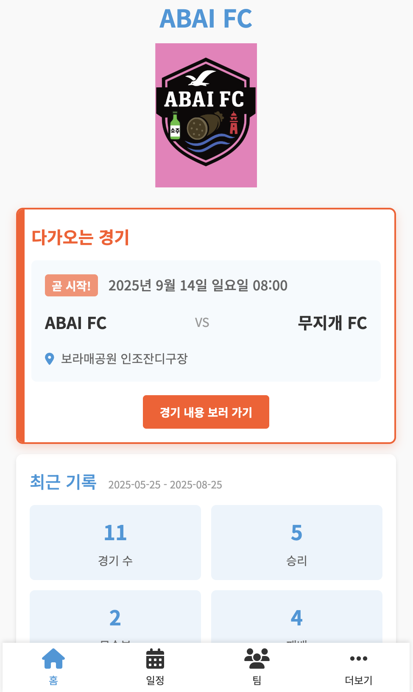
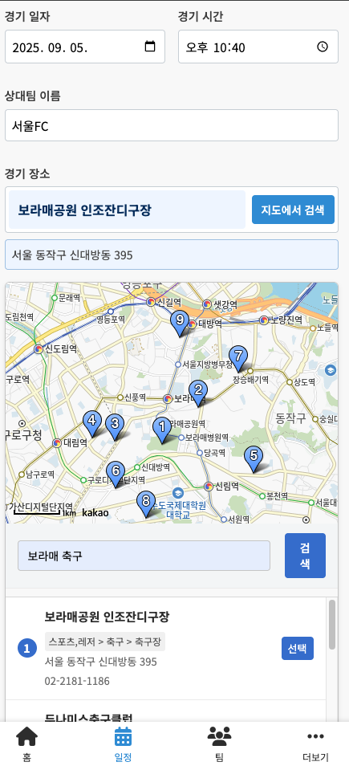
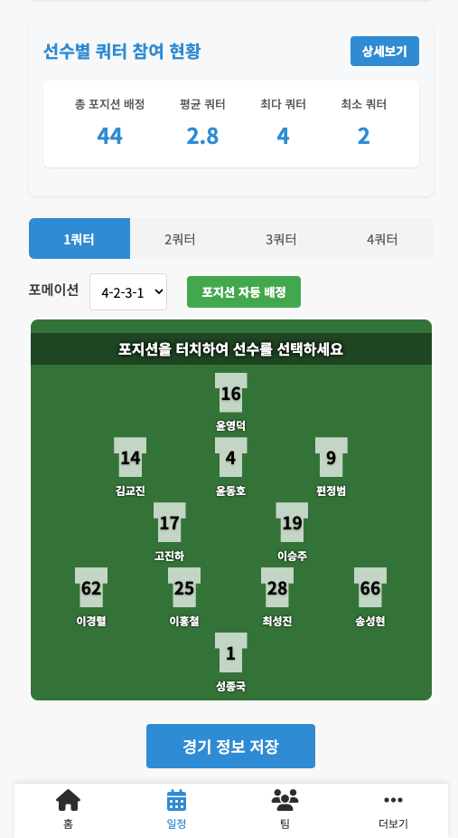
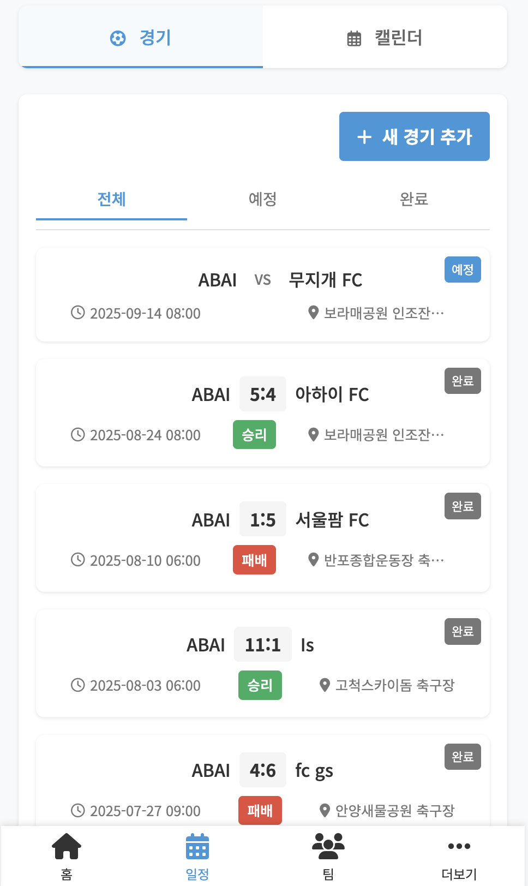
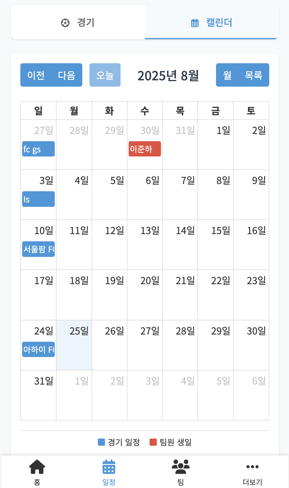
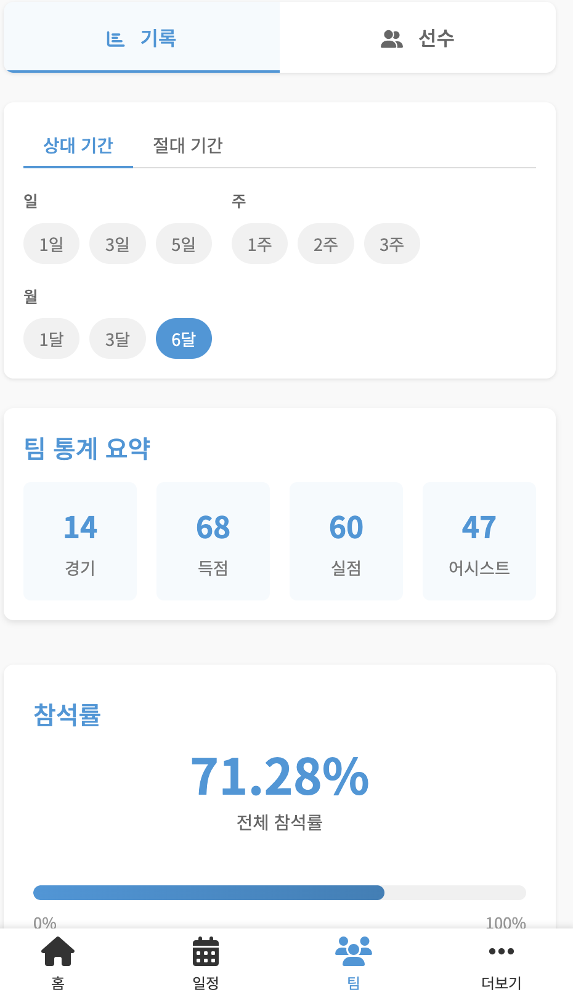
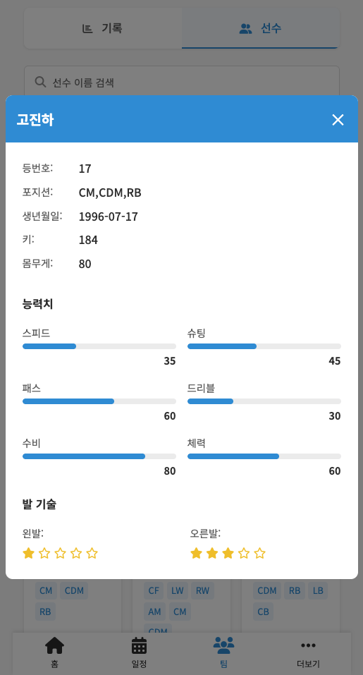
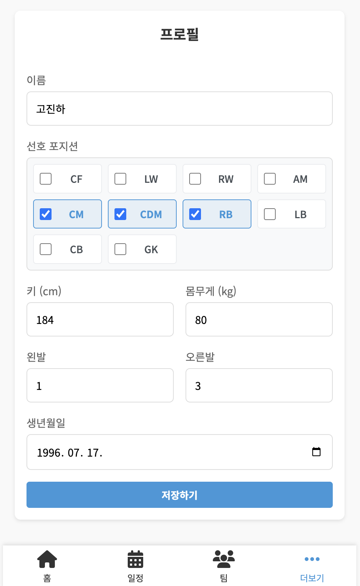
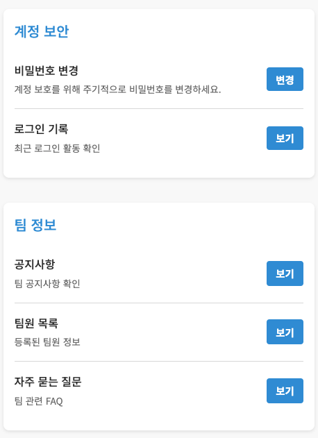

# ABAI FC - 축구팀 관리 시스템

## 📋 프로젝트 개요

ABAI FC를 위한 종합 관리 시스템입니다. <br>
AI를 활용한 화면 제작과 Exposed를 익히기 위한 프로젝트이며 <br>
팀원 관리, 경기 일정 관리, 장비 관리, 공지사항 등 축구팀 운영에 필요한 모든 기능을 제공합니다.

## 🚀 주요 기능

### 👥 팀원 관리
- 회원 추가 및 로그인
- 팀원 프로필 관리
- 포지션별 팀원 분류
- 로그인 히스토리 추적

### ⚽ 경기 관리
- 경기 일정 등록 및 관리
- 경기 결과 기록
- 경기 참석자 관리
- 포메이션 설정(자동, 수동)

### 🏟️ 일정 관리
- FullCalendar를 활용한 캘린더 뷰
- 경기 일정 시각화
- 다가오는 경기 알림

### 🛠️ 장비 관리
- 팀 장비 등록 및 관리
- 장비 상태 추적
- 장비 대여/반납 관리

### 📢 커뮤니케이션
- 공지사항 게시
- FAQ 관리
- 팀 소식 전달

### 📊 통계 및 기록
- 경기 결과 통계
- 팀 성과 분석
- 개인 기록 관리

## 🛠️ 기술 스택

### Backend
- **Language**: Kotlin 1.9.25
- **Framework**: Spring Boot 3.4.5
- **Java Version**: 17
- **Database**: PostgreSQL
- **ORM**: Exposed (Kotlin SQL Framework)
- **Security**: Spring Security 6
- **Template Engine**: Thymeleaf

### Infrastructure
- **Container**: Docker
- **Base Image**: Alpine Linux 3.15
- **Build Tool**: Gradle (Kotlin DSL)

## 🏗️ 프로젝트 구조

```
src/main/kotlin/com/kokoo/abai/
├── core/                   # 핵심 비즈니스 로직
│   ├── admin/              # 관리자 기능
│   ├── equipment/          # 장비 관리
│   ├── faq/                # FAQ 관리
│   ├── guest/              # 게스트 관리
│   ├── match/              # 경기 관리
│   ├── member/             # 팀원 관리
│   ├── my/                 # 내 정보 관리
│   ├── notice/             # 공지사항
│   └── record/             # 기록 관리
├── common/                 # 공통 기능
│   ├── config/             # 설정
│   ├── constant/           # 상수
│   ├── error/              # 에러 처리
│   ├── exception/          # 예외 처리
│   ├── extension/          # 확장 함수
│   └── pagination/         # 페이징
└── web/                    # 웹 컨트롤러
```

## 🚀 실행 방법

### 1. 환경 요구사항
- Java 17 이상
- PostgreSQL 16 이상
- Gradle 8.0 이상

### 2. 데이터베이스 설정
```yaml
# src/main/resources/config/database.yml
spring:
  datasource:
    url: # jdbc url
    username: # db id
    password: # db password
```

### 3. 애플리케이션 실행
```bash
# 환경
nohup java -jar -Dspring.profiles.active={환경명} /home/ubuntu/java/abai-0.0.1-SNAPSHOT.jar
```

## 📱 화면 구성

### 메인


### 경기 관리



### 일정 관리



### 팀 관리



### 기타 메뉴



**ABAI FC** - 함께 만들어가는 축구팀의 미래 🏆